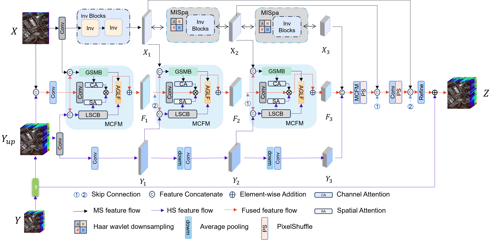

#  Spatial Invertible Network With Mamba-Convolution for  Hyperspectral Image Fusion

 The code for 《 Spatial Invertible Network With Mamba-Convolution for  Hyperspectral Image Fusion》

 

Our model was trained on an NVIDIA A800-SXM4-80GB GPU.

    

## 👉 Data

We conducted 10 distinct data partitions based on [IF_CALC](https://github.com/Ding-Kexin/IF_CALC/blob/main/Model/index_2_data.py) implementation and adopted the average results across these iterations as the final reported outcomes in our study.

* [CAVE]([https://hyperspectral.ee.uh.edu/](https://www.cs.columbia.edu/CAVE/databases/multispectral/)

* [Harvard](http://vision.seas.harvard.edu/hyperspec/)

* [Pavia](https://github.com/liangjiandeng/HyperPanCollection)

## 🌿 Getting Started

### Environment Setup

To get started, we recommend setting up a conda environment and installing dependencies via pip. Use the following commands to set up your environment.
    
    conda create -n mcfnet python==3.11
    
    conda activate mcfnet
    
    pip install -r requirements.txt
    
    pip install PyWavelets

### Train 
    1、
    python Train_cave.py

### Citation
If this code is useful for your research, please cite this paper.

## 🌸 Acknowledgment
